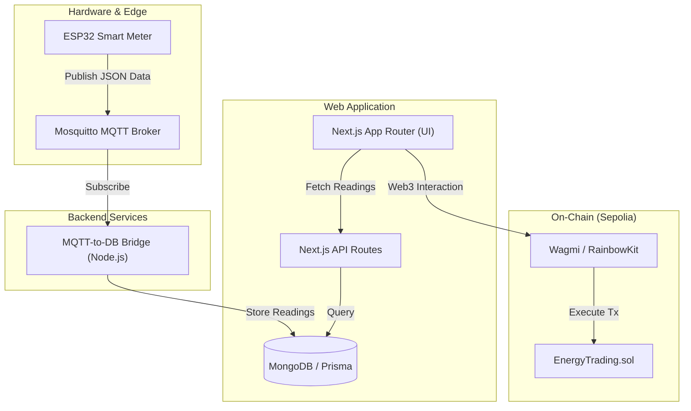

# ⚡ Solix: Peer-to-Peer Energy Trading Platform

Solix is a **decentralized energy grid** built on **Ethereum Sepolia**. It enables a P2P energy ecosystem where producers (with solar setups) can feed surplus energy into the grid, and consumers can purchase it directly. The entire transaction flow is handled by smart contracts, ensuring transparency and direct payments to producers.

> **Stack:** Next.js 15 (App Router) · Solidity/Foundry · ESP32 IoT · MongoDB/Prisma · MQTT · Tailwind CSS · RainbowKit/Wagmi

---

## 🏗️ System Architecture



---

## 🚦 End-to-End Flow

1.  **Generation**: ESP32 Smart Meter measures solar production and home consumption.
2.  **Transmission**: ESP32 publishes data to a Mosquitto MQTT broker every 5 seconds.
3.  **Bridging**: A dedicated Node.js service (`mqtt_bridge`) listens to MQTT topics and persists readings into MongoDB via Prisma.
4.  **Registration**: Users connect their wallets (MetaMask) and register as Producers or Consumers on-chain.
5.  **Trading**:
    *   **Producers** click "Feed Grid" to list their surplus energy on the smart contract.
    *   **Consumers** browse the grid and buy energy using ETH.
6.  **Settlement**: Smart contracts automatically transfer ETH from Consumer to Producer and record the immutable transaction.

---

## 📁 Directory Structure

| Directory | Description |
|-----------|-------------|
| [`app/`](file:///home/varun/web/solix/app) | Next.js 15 frontend and API routes. |
| [`blockchain/`](file:///home/varun/web/solix/blockchain) | Foundry project for Solidity smart contracts. |
| [`esp32/`](file:///home/varun/web/solix/esp32) | Firmware for the ESP32 smart meter (Arduino C++). |
| [`services/mqtt_bridge/`](file:///home/varun/web/solix/services/mqtt_bridge) | Node.js service that syncs MQTT data to the database. |
| [`prisma/`](file:///home/varun/web/solix/prisma) | Database schema and migrations (MongoDB). |
| [`components/`](file:///home/varun/web/solix/components) | Reusable UI components (Shadcn UI). |
| [`docs/`](file:///home/varun/web/solix/docs) | Project documentation and flow charts. |

---

## 🛠️ Tech Stack

*   **Frontend**: Next.js 15, Tailwind CSS, Shadcn UI, Lucide Icons.
*   **Web3**: RainbowKit, Wagmi, Viem.
*   **Backend**: Prisma ORM, MongoDB.
*   **IoT**: ESP32, MQTT (Mosquitto), ArduinoJson.
*   **Blockchain**: Solidity, Foundry (Forge/Cast).

---

## 🚀 Getting Started

### 1. Prerequisites
*   Node.js (v18+)
*   pnpm
*   MongoDB Instance
*   Mosquitto MQTT Broker
*   Foundry (for blockchain development)

### 2. Environment Configuration
Create a `.env` file in the root:
```env
DATABASE_URL="mongodb+srv://..."
NEXT_PUBLIC_WC_PROJECT_ID="your_walletconnect_project_id"
MQTT_BROKER="mqtt://your-broker-ip:1883"
```

### 3. Installation
```bash
# Install dependencies
pnpm install

# Generate Prisma client
npx prisma generate

# Start development server
pnpm dev
```

### 4. Running the MQTT Bridge
```bash
cd services/mqtt_bridge
npm install
npm start
```

### 5. Smart Contract Deployment
```bash
cd blockchain
forge build
# Deploy to Sepolia (update script as needed)
forge script script/Deploy.s.sol --rpc-url $SEPOLIA_RPC_URL --broadcast
```

---

## 📝 License
MIT
