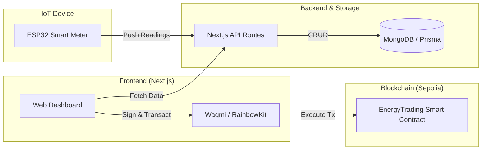
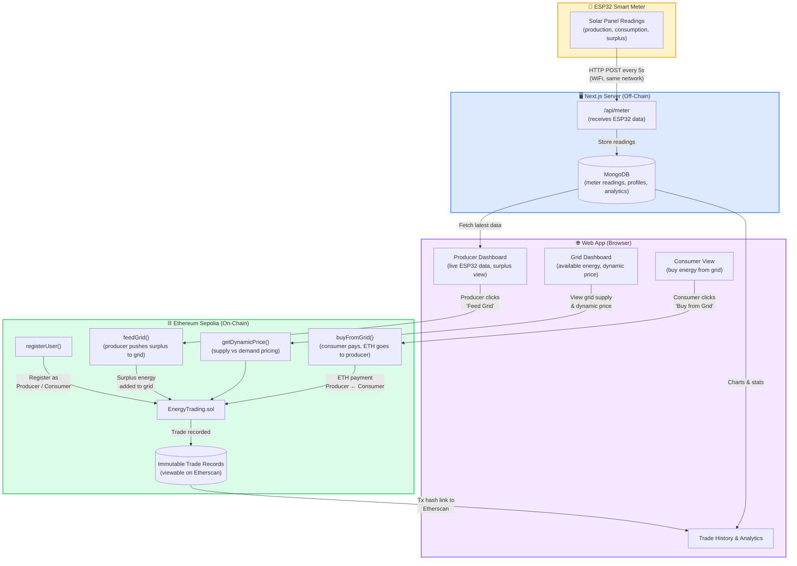
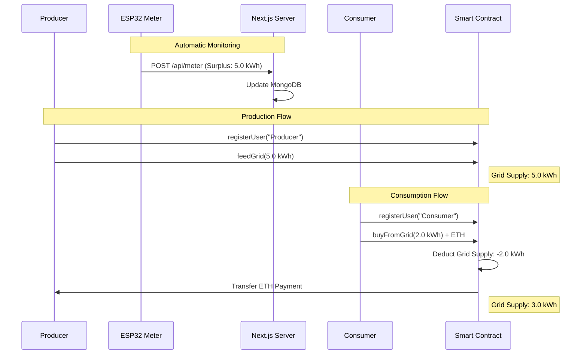

# ⚡ Peer-to-Peer Energy Trading Platform

A **decentralized energy grid** built on **Ethereum Sepolia** where a single producer feeds surplus solar energy into the grid, and consumers purchase it — with the producer getting paid directly via smart contracts.

> **Stack:** Next.js 14 · Solidity/Foundry · ESP32 IoT · MongoDB · RainbowKit/Wagmi

---

## System Architecture



---

## End-to-End Flow



### Flow Summary

| Step | Action | Where |
|------|--------|-------|
| 1 | ESP32 smart meter sends solar readings every 5s | Off-chain (MongoDB) |
| 2 | **Producer** connects wallet & registers | On-chain (Sepolia) |
| 3 | Producer clicks **"Feed Grid"** → surplus enters the grid | On-chain (Sepolia) |
| 4 | **Consumer** connects wallet & registers | On-chain (Sepolia) |
| 5 | Consumer views grid supply & dynamic price | On-chain read |
| 6 | Consumer clicks **"Buy from Grid"** → pays ETH | On-chain (Sepolia) |
| 7 | **Producer gets paid** automatically via smart contract | On-chain (Sepolia) |
| 8 | Trade recorded permanently → viewable on Etherscan | On-chain (Sepolia) |

---

## Technical Approach (Sequence)



---

## Getting Started

```bash
pnpm install
pnpm dev
```

Open [http://localhost:3000](http://localhost:3000) to see the app.

---

## Tech Stack

| Layer | Technology |
|-------|-----------|
| Fullstack | Next.js 14 (App Router) |
| Styling | Tailwind CSS |
| Wallet | RainbowKit + Wagmi |
| Database | MongoDB (Prisma) |
| Blockchain | Solidity + Foundry |
| Network | Ethereum Sepolia Testnet |
| IoT | ESP32 (Arduino C++) |
| Charts | Recharts |
